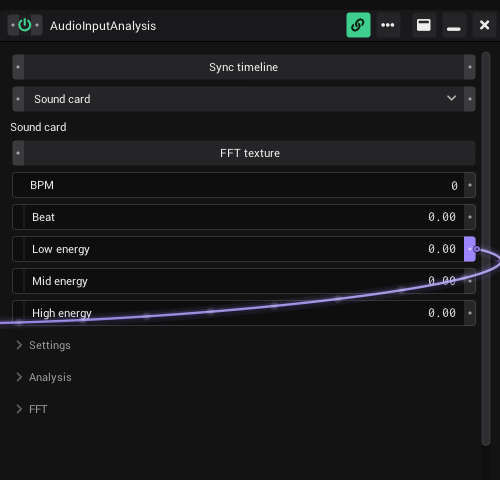

# Audio

The generator *Audio Input Analysis* listens to the music and turns it into values you can link: the tempo, the beat, the
energy of bass, mids and highs, and whether a break is playing. It can also keep the timeline in time with the music.

## Add it

1. Open the sidebar tab **Assets** and go to *Generators › Audio*.
2. Drag *AudioInputAnalysis* into a view. The window opens and the analysis starts.
3. Choose the **Source** (see below). The line under it says what VibeVJ hears right now.
4. Play music. *Beat*, *BPM* and the energy rows start to move.
5. Link the rows you need into other controls: drag from the right notch of *Beat* onto the control it should drive.

The power button in the window header must be on (green). With the power off the analysis stops and every value stays where
it was.

## Source

| Source | What it uses | Line under *Source* |
|---|---|---|
| *Sound card* | The default recording input of your computer (line-in, microphone, audio interface). Choose that input in the sound settings of your system; VibeVJ has no device list of its own. | "Sound card" |
| *ESP32 (USB)* | The microphone or line-in of a prolink-bridge ESP32 on USB. It shares the USB connection with the Prolink generators. | "ESP32 USB: … kHz" while audio comes in |
| *ESP32 (network)* | The same audio from a relay ESP32 in your network, over ShizoNet. | "ESP32 relay: … kHz" or "ESP32 listener via relay: … kHz" |

For the ESP32 the firmware must send audio (firmware command "audio mic" or "audio line"). If it does not, the line says
"No audio from the ESP32 (firmware: audio mic|line)". With *ESP32 (USB)* and no board found it says "ESP32 not connected".
The setting *ESP32 port (empty = auto)* in *Settings* picks a USB port by hand; leave it empty to find the board by itself.

## The values

These rows are **pure outputs**: the analysis writes them all the time. They have only a right notch. Link **from** them
into other controls; a link into them is refused.

| Row | What it shows |
|---|---|
| *BPM* | The tempo the analysis hears. It glides to a new tempo instead of jumping. |
| *Beat* | Where you are inside the current beat, 0 to 1. It starts again at 0 on every beat. |
| *Low energy* | Energy of the bass, below *Low energy cutoff*. 0 to 1. |
| *Mid energy* | Energy between the two cutoffs. 0 to 1. |
| *High energy* | Energy above *High energy cutoff*. 0 to 1. |
| *Score* (section *Analysis*) | The running score of the beat tracker, 0 to 10000. |
| *Break* (section *Analysis*) | 1 while a break plays, else 0. |
| *Break inverted* (section *Analysis*) | 0 while a break plays, else 1. |

The energy rows adapt to the level of the music: 1 means as loud as that band was lately, 0 as quiet. You do not need to set
a gain.

## Sync timeline

Turn on **Sync timeline** and the timeline follows the music: its BPM is set to the analysis *BPM* and its position is
nudged onto the beat, every frame. While it is on, a BPM you type in the timeline is overwritten. Turn it off to set the
tempo by hand. See [Timeline](Timeline.md).

## Settings

| Setting | Default | What it does |
|---|---|---|
| *Fix BPM* | *Auto* | *Auto* (-1) lets the analysis find the tempo. Type a tempo to lock the beat tracker to it. |
| *Phase offset* | 0 | Shifts *Beat* (and with it the timeline sync) by up to half a beat, -0.5 to 0.5. Use it when the visuals are early or late against the sound. |
| *Break threshold* | 0.3 | A break starts when the bass falls below this share of its normal level. Higher = breaks are found sooner. |
| *Drop threshold* | 0.6 | The break ends (the drop) when the bass comes back above this share of its normal level. |
| *Low energy cutoff* | 250 Hz | Upper end of *Low energy*, lower end of *Mid energy*. |
| *High energy cutoff* | 4000 Hz | Upper end of *Mid energy*, lower end of *High energy*. |
| *ESP32 port (empty = auto)* | empty | Only for *ESP32 (USB)*, see above. |

A break lasts at least 1.5 seconds, and a new one can start 3 seconds after the last one at the earliest. There is no
separate drop row: the drop is the moment *Break* goes back to 0.

## FFT texture

The row **FFT texture** is a texture output with an *Out* port. It holds the spectrum (512 bands, low to high) in its first
row and the waveform in its second row. Link it into the input of an audio shader, for example one from
*Shaders › Sources › Audio*, to draw with the sound. The preview at the bottom of the window shows the same data.

The section **FFT** shapes the spectrum:

| Setting | Default | What it does |
|---|---|---|
| *Band smoothing* | 5 | Blends each band with this many neighbours, 0 to 50. Higher = smoother. |
| *Attack* | 0.2 | How fast a band rises. Higher = faster. |
| *Decay* | 1.0 | How long the loudest level is remembered. Lower = more dynamic. Works from 0.8 up; lower values act like 0.8. |
| *Release* | 0.08 | How fast a band falls. Higher = faster. |
| *Noise floor* | 0.6 | Bands below this share of their peak are set to 0. |

## See also

- [Linking](Linking.md): link the values into your generators
- [Timeline](Timeline.md): BPM, *Tap*, the beat
- [Output and devices](Output-and-Devices.md): Prolink, which also gives tempo and levels from the CDJs
- [Troubleshooting](Troubleshooting.md): no audio, ESP32 not found
- [Glossary](../../design/wiki/Glossary.md): pure output
