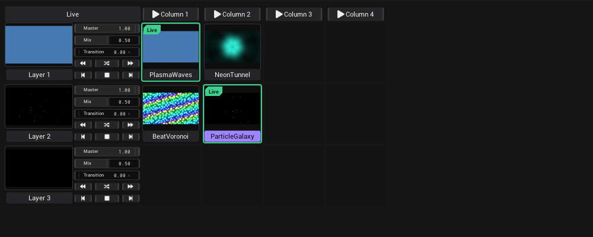

# Clipview

The Clipview is where you play clips live. Each row is a layer, each cell is a clip, and you start clips by hand, by column,
by MIDI or with autoplay.

## The parts

| Part | Where | What it does |
|---|---|---|
| *Live* | top left corner | Locks the grid for playing: clips can't be moved and name tags become plain labels. |
| *Column 1*, *Column 2* … | top row | Starts every clip in that column at once. |
| Layer | left column | Layer picture, *Layer n* name tag, *Master*, *Mix*, *Transition* and the transport buttons. |
| Clip | each cell | The clip picture (click to start it) and its name tag below (click to select it). |
| *Preview* | bottom left window | The finished picture of the whole Clipview. |
| *Layer* | bottom right window | The settings of the selected clip or layer. |
| *Out* | bottom right corner | The finished picture as a port, to link to an output. |

Drag the top edge of the *Preview* or *Layer* window up or down to give the grid more or less room. Drag the edge between the
two windows to change their widths.

## Layers

Layer 1 is the top row and gives the final picture. Each layer lays its live clip over the layers below it.

| Control | What it does |
|---|---|
| *Master* | Brightness of the whole layer. 1 = full, 0 = black. |
| *Mix* | How strongly the layer's clip is blended over the layers below. |
| *Transition* | How long the fade to a new clip takes, in seconds (*s*). 0 = a hard cut. |

*Transition* counts seconds, whatever the tempo: *Transition* 4 fades for four seconds.

Click a layer's name tag to see its settings in the *Layer* window, in the section *Layer Settings*:

| Setting | What it does |
|---|---|
| *Name* | The name on the layer's tag. |
| *Layer input from* | Which layer this one is laid over. 1 (default) = the layer below. |
| *Autoplay* › *Duration* | How long each clip plays during autoplay, in beats. Default 64. |
| *Macros* › *Map to clip macros*, *Macro 1* … *Macro 8* | See [Macros](#macros). |

## Clips

1. Open the *Assets* tab in the sidebar.
2. Drag a shader or generator onto an empty cell. It becomes a clip. The grid always keeps one free row and one free column
   at the edge, so there is room for the next clip.
3. Drag another asset onto an existing clip to stack it onto that clip as an effect.
4. Click the clip picture to start it.
5. Click the clip's name tag to select it (violet). The *Layer* window shows its effects and the section *Clip Settings*.

To move a clip, drag it by its name tag to another cell. Hold Ctrl when you let go to copy it instead.

## Live and next clips

| What you see | Means |
|---|---|
| Green ring and *Live* badge | The clip is on air. |
| Dashed green ring | The clip is fading in (a transition is running). |
| Amber ring and *Next* badge | You started this clip while a transition was running. It plays when the fade ends. |

Start the fading-in clip again to cancel the queued *Next* clip.

## Transport buttons

Each layer has two rows of three buttons. Each one can be linked or mapped to MIDI.

| Button | Tooltip | What it does |
|---|---|---|
| Backward | *Autoplay backwards* | Autoplay goes to the left, wraps at the start. |
| Random | *Autoplay random* | Autoplay in random order: every column once, then a new order. |
| Forward | *Autoplay forwards* | Autoplay goes to the right, wraps at the end. |
| Previous | *Previous clip* | Starts the clip to the left of the live one. |
| Stop | *Stop the layer* | Turns autoplay off and stops the layer. No clip is live. |
| Next | *Next clip* | Starts the clip to the right of the live one. |

The three autoplay buttons are toggles, only one can be on (green). Click it again to turn autoplay off.

## Autoplay and Duration

1. Press *Play* in the [Timeline](Timeline.md). Autoplay counts timeline beats, so it waits while the timeline is stopped.
2. Set the layer's *Duration* in *Layer Settings* › *Autoplay*.
3. Turn on one of the autoplay buttons.

Starting a clip by hand starts the count again. Autoplay, *Previous clip* and *Next clip* skip clips with *Trigger* set to
*Hold* and clips with *Exclude* on.

## Clip settings

| Setting | What it does |
|---|---|
| *Name* | The name on the clip's tag. |
| *Trigger* | *Normal*: a click starts the clip. *Hold*: the clip plays while you hold the picture; on release the last *Normal* clip of the layer comes back. |
| *Inputs* | For each input of the clip: which layer's picture it gets. See below. |
| *Autoplay* › *Exclude* | Autoplay, *Previous clip* and *Next clip* skip this clip. |
| *Autoplay* › *Duration* | This clip's own play time in beats. *Layer* (-1) uses the layer's *Duration*. |
| *Autoplay* › *Transition* | This clip's own fade time. *Layer* (-1) uses the layer's *Transition*. |
| *Macros* › *Macro 1* … *Macro 8* | Eight sliders you can link to anything inside the clip. |

### Inputs: Relative / Absolute

Effects that take a picture can use another layer as their input. The line above the inputs reads
"−1 layer above · 0 off · +1 layer below".

- **Relative:** the number counts from the clip's own layer. 1 = the layer below, −1 = the layer above, 0 = off.
- **Absolute:** the number picks one fixed layer, wherever the clip sits.

## Macros

Macros let one set of knobs control whichever clip is playing.

1. In each clip, link its *Macro 1* … *Macro 8* to the effect values you want to play with (see [Linking](Linking.md)).
2. In the layer's settings, turn on *Map to clip macros*.
3. Map the layer's *Macro 1* … *Macro 8* to your controller (see [MIDI](MIDI.md)).

When a clip starts, the layer macros jump to that clip's macro values. Moving a layer macro then moves the same macro of
that clip.

## See also

- [Linking](Linking.md): notches, cables and link types
- [Timeline](Timeline.md): tempo, Play and show mode
- [Generators](Generators.md): what goes into a clip
- [Shortcuts and tips](Shortcuts-and-Tips.md)
- Design: [Views](../../design/wiki/Views.md), [Glossary](../../design/wiki/Glossary.md)
