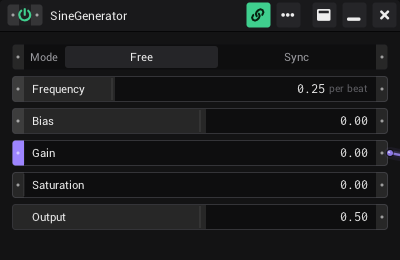

# Generators

A generator is the building block of VibeVJ. This page explains what a generator is, how you add one, what the buttons in
its window header do, and how you keep its settings as a preset.

## What a generator is

Every effect, source, input, output and utility in VibeVJ is a generator: a shader, an LFO, the audio analysis, an Art-Net
sender, a text box. Even the views (Clipview, Patchview, Tabview) are generators. Each one runs in its own window with its
own controls, and every control can be linked to any other control (see [Linking](Linking.md)).

These files open as a generator:

| In the *Assets* tab | Becomes |
|---|---|
| An asset (cube icon; the folder ends in `.asset`, the list shows the name without it) | A generator with its own controls, for example *SineGenerator* |
| A folder ending in `.glsl` (cube icon) | A shader generator, for example from `Shaders` › `Sources` or `Effects` |
| A `.png` image | An image generator |
| A `.txt` file | A text generator |
| A video file (`.mp4`, `.mov`, `.mkv`, `.webm`, `.avi` and more) | A video player |
| A `.preset` file | The generator the preset belongs to, with the saved settings (see [Presets](#presets)) |

## Add a generator

1. Open the *Assets* tab in the sidebar.
2. Find the asset. Type part of its name into *Filter* to find it faster.
3. Drag it into a view:
   - into a **Patchview** or the timeline area: the window opens where you drop it;
   - into an **empty part** (the *Views* tab, a tab, half of a split): it fills the part;
   - onto the **tab bar of a Tabview**: you get a new tab with it;
   - into a **Clipview**: it becomes a clip (see [Clipview](Clipview.md)).

To remove a generator, click × in its header. In a part that already holds something, dropping a new asset replaces it
after the question "Overwrite view?".

## The window header

The header runs along the top of the window. From left to right (on the right in the Windows order: minimize, maximize, close):

| Button | Tooltip | What it does |
|---|---|---|
| Chevron | *Collapse* / *Expand* | Shrinks the window to its header and opens it again at its old size. It points down while the window is open and right while it is collapsed. The same switch as the minimize button. |
| Power icon | *Generator active* | Switches the generator on and off. The icon is green while it runs. When it is off, the generator stops and its name is dimmed. It is a control: you can link it or map it to MIDI. |
| Link icon | *Always draw links* | Draws the cables of this generator all the time and shows its notches in full, even when *Cable view* is off. Saved with the project. |
| Name | | The name of the asset |
| ⋯ | *More* | Opens the menu with the less used actions (below). |
| Minimize | *Collapse* / *Expand* | Shrinks the window to its header. Press it again to open it. The same switch as the chevron, saved with the project. |
| Maximize | *Maximize* | The window fills the whole view and the other windows are hidden. Press it again to go back. While maximized, the chevron, *Minimize* and *Close* are hidden. |
| × | *Close* | Closes the generator. |

> Screenshot to add: the header from left to right, with each button labelled.

### The ⋯ menu

| Item | What it does |
|---|---|
| *Copy settings* | Copies the settings of this generator. |
| *Paste settings* | Puts the copied settings into this generator. Works only between generators of the same asset; otherwise nothing happens. |
| *Save preset…* | Saves the settings as a preset file (see [Presets](#presets)). |
| *Reload module* | Loads the generator's code again and keeps its settings. Useful after you changed the asset's files. |
| *Hide header (E)* | Hides the header. Press E to show it again. |

### Hide and show the header with E

1. Click into the generator window.
2. Press E. The header disappears, or comes back if it was hidden.

This also works where a generator has no header at first: in the *Views* tab, in a tab of a Tabview and in a split. Press E
there to reach the power button, the ⋯ menu and the other buttons.

## Presets

A preset is a file with the settings of one generator. It is stored inside the asset, so it shows up next to it in the
*Assets* tab.

To save a preset:

1. Click ⋯ › *Save preset…*.
2. Type a *Preset name*.
3. Click *Save*. The file `<preset name>.preset` is written to the `presets` folder inside the asset.

To use a preset:

1. In the *Assets* tab, open the asset and its `presets` folder. Press refresh if the new preset is not listed yet.
2. Drag the `.preset` file into a view, like any asset.
3. The generator opens with the saved settings, where you dropped it. The position and size of the window are not part of
   the preset.

Many assets come with presets already, for example the Tabview and some shaders.

To copy settings from one window to another without a file, use *Copy settings* and *Paste settings* instead.

## In show mode

In show mode (the lock in the timeline bar) you can still use the power button and all values. These do nothing until you
leave show mode: *Close*, *Paste settings* and *Reload module*. Windows cannot be moved or resized. See
[Timeline](Timeline.md).

## See also

- [Linking](Linking.md)
- [The screen](The-Screen.md)
- [Clipview](Clipview.md)
- [Shortcuts and tips](Shortcuts-and-Tips.md)
- [Glossary](../../design/wiki/Glossary.md) (design wiki)
