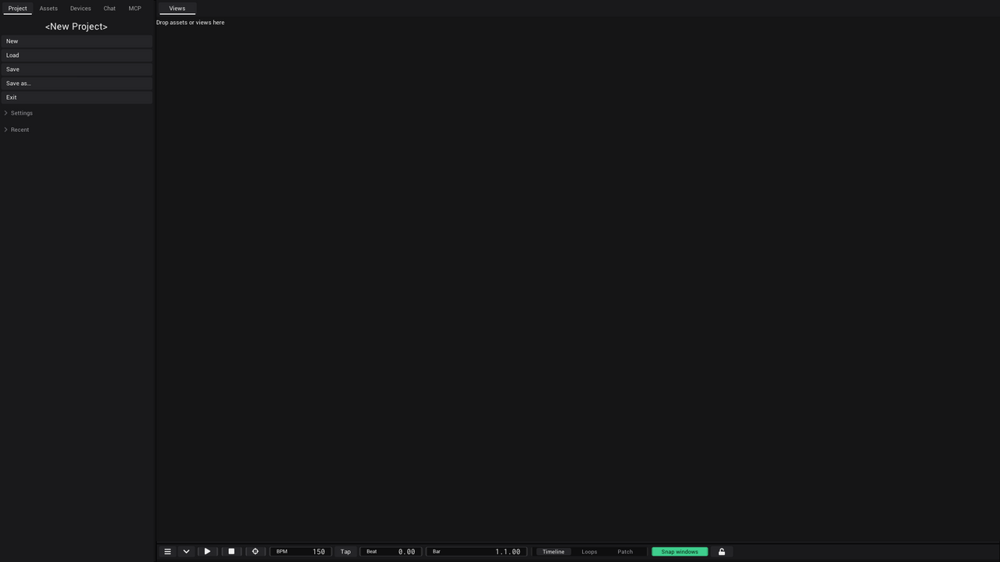
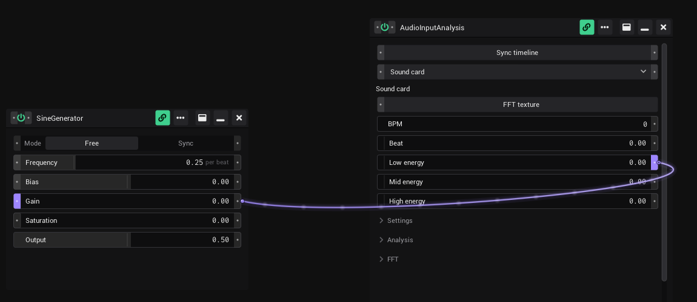

# Getting started

This page gets you from the download to your first saved project: install VibeVJ, start it, build a small project, save it
and open it again.

## Install

VibeVJ is portable. There is no installer and nothing else to install.

1. Download the portable version of VibeVJ for Windows (GitHub: `shizotech/shizoengine3_standalone`).
2. Unpack it into a folder where you are allowed to write files, for example your *Documents* folder. VibeVJ keeps your
   projects and personal settings inside its own folder.
3. In the folder you find `VibeVJ.exe` and a folder `VibeVJ` with the assets, the engine and your projects.

The Linux build works the same way. Its program file is `VibeVJ.out`.

## Start

1. Double-click `VibeVJ.exe` (on Linux: start `VibeVJ.out` in its folder).
2. VibeVJ opens the project you used last. The very first time this is the example project *first_time*.
3. While a project loads, the screen shows *Loading...*.

The VibeVJ window has no title bar of its own. On Windows you move it by dragging an empty part of a tab bar, for example
next to the sidebar tabs.

## Your first project

1. In the sidebar, open the *Project* tab and click *New*.
2. Answer "Create a new project?" with *Yes*. The project name at the top now reads *&lt;New Project&gt;*.
3. Open the *Assets* tab. Open the folder `Views` and drag *Patchview* (cube icon) into the big area on the right, where it says
   "Drop assets or views here". The Patchview is a free area for generator windows.
4. In the *Assets* tab, open `Generators` › `Math` and drag *SineGenerator* into the Patchview. It opens in its own
   window where you drop it.
5. Drag a second generator next to it, for example a shader from `Shaders` › `Sources`.
6. Link the two: drag from the right notch of the Sine Generator's *Output* onto a control of the shader. The shader
   control now moves with the sine wave. How links work is on [Linking](Linking.md).
7. Save the project (see below).

## Save

All project actions are in the *Project* tab of the sidebar.

| Button | What it does |
|---|---|
| *New* | Asks "Create a new project?" and then clears all views, generators and links. |
| *Load* | Asks for a project name and opens that project. |
| *Save* | Saves the project. A new project without a name first asks for one. |
| *Save as…* | Asks for a new name and saves the project under it. From then on you work in the new project. |
| *Exit* | Saves the project and closes VibeVJ. |
| *Recent* | Opens a list of your projects. Click one to open it. |

To save a project for the first time:

1. Click *Save* (or *Save as…*).
2. In the dialog *Save project*, type a name in *Project name*.
3. Click *Save*. While it saves, the screen shows *Saving...*. The name appears at the top of the *Project* tab.

**Exit and unsaved projects:** *Exit* saves only a project that has a name. A new project that was never saved is closed
without a question, and your work is lost. Use *Save as…* first.

### What is saved with a project

Every project is a folder in `VibeVJ/projects/<project name>/`. It holds:

- your views and generators, with their windows, positions and sizes,
- the values of all controls, your links and MIDI mappings,
- the generators in the timeline area,
- your fixtures,
- the project settings in *Project* › *Settings* (see [Settings](Settings.md)).

Not in the project: the accent colour and *Calm notches*. They are personal and valid for every project.

To copy or back up a project, copy its folder.

## Open a project

1. In the *Project* tab, click *Recent* to open the list.
2. Click the name of the project.

Or with *Load*:

1. Click *Load*.
2. Type the name exactly as the project folder is called.
3. Click *Load*.

The *Recent* list is made when VibeVJ starts. A project you saved for the first time shows up there after the next
start.

**Careful with typing:** if no project with that name exists, VibeVJ does not open an empty project. Your current content
stays on the screen, but it now belongs to the new name and is saved there. Pick the project from *Recent* to be sure.

## Next steps

- Find your way around the window: [The screen](The-Screen.md).
- Learn the generator window: [Generators](Generators.md).
- Play clips live: [Clipview](Clipview.md).
- Connect a controller: [MIDI](MIDI.md).

## See also

- [The screen](The-Screen.md)
- [Generators](Generators.md)
- [Settings](Settings.md)
- [Troubleshooting](Troubleshooting.md)
- [Glossary](../../design/wiki/Glossary.md) (design wiki)
