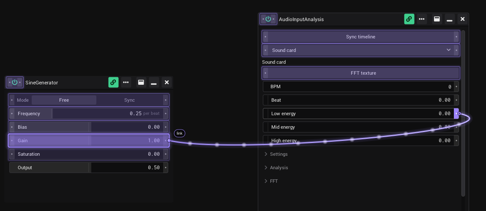
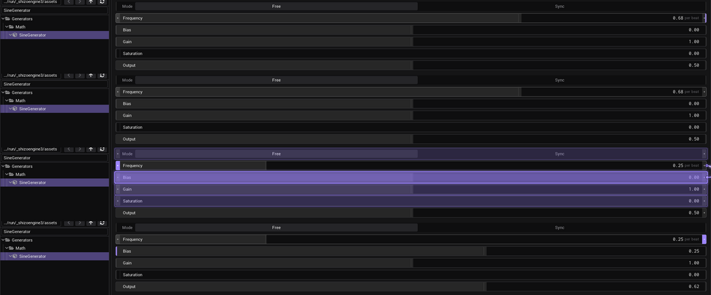
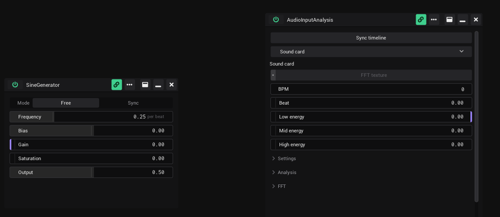

# Linking

Any control can drive any other control. A link sends one control's value to another: an LFO moves a slider, a button starts
a clip, the audio beat drives an effect.

## Notches: left in, right out

Every linkable row has two small tabs, the notches.

| Notch | Means | Click | Drag |
|---|---|---|---|
| Left (input) | Something can come in. Violet when a link arrives. | Opens the options | Starts a link |
| Right (output) | Something goes out. Filled with its cable colour. | Opens the options | Starts a link |

Cables run the same way: they leave the right notch of the sender and end at the left notch of the receiver. If the receiver
sits further left than the sender, the cable hangs in a loop below both and still comes into the receiver from the left.

On very small buttons (the Clipview transport buttons) a click on the right notch presses the button. Use the left notch for
the options there; dragging from the right notch still links.

### Calm notches

So the screen stays quiet, free notches rest as thin grey edges. A linked notch is open; hover a row and all its notches
open in full. In the sidebar, *Project* › *Settings* › *Appearance*:

- *Linked notches* → *Edge only* keeps linked notches as thin coloured edges too, until you hover the row.
- *Calm notches* chooses where the grey edges of free notches are drawn:

  - *Everywhere* (default)
  - *Clipview only*: outside the Clipview a free notch shows nothing until you hover its row; a slider then marks the
    end of its travel with a short grey line. Linked notches show everywhere.

## Make a link

1. Hover the row you want to send from. Its notches open.
2. Press on its right notch and drag. Every control that can take the link gets a thin violet outline.
3. Let go over the control that should receive. It gets a stronger outline while you are over it, and the label at the
   cable end says *link*.

You can also start from the left notch, as plain drag and drop. The result is the same: the link goes from the row where you
start to the row where you let go. A control can't link to itself.

### Hold and drag

Made for touch screens, works with the mouse too.

1. Press anywhere on a row and hold still for 400 ms. The notch fills up with violet.
2. Drag. On the right half of the row the link starts from the output, on the left half from the input.

If you move before 400 ms, the row changes its value as usual. If the press had already changed the value, the value goes
back when the link starts. Hold and drag works on value fields and buttons, not on *In* / *Out* ports and not on a slider's
thumb (the violet bar): holding the thumb still before you move it just picks it up.

An *Out* port carries its dot on the right, where its cables leave; an *In* port on the left. Like every notch, a port's cap
is only a thin edge until the port is linked or the mouse is over it. An *Out* port takes no links, its generator writes it.

## Remove a link

- Drag the same link again onto the same receiver. The cable turns red and dashed, its label says *unlink*, and letting go
  removes the link.
- Or open the options (click a notch), go to *Out* or *In*, and click × next to the link.

## The link list

Click a notch to open the options of a control. They close when you click anywhere outside them, or the notch again.

| Tab | What is there |
|---|---|
| *Main* | The control's display name, used in link lists. |
| *In* | The links that come in. *Select sender* lists the controls marked as sender, to link from one without dragging. |
| *Out* | The links that go out. *Make sender* marks this control as a sender. |
| *MIDI* | The MIDI mapping, see [MIDI](MIDI.md). |

Each link row shows the other control, the link type and × to remove it.

## Link types

The type sets how the value travels. Change it in the link list.

| Type | What the receiver gets | Cable |
|---|---|---|
| *Absolute* | The raw value. | Accent colour (violet by default), solid |
| *Normalized* | The sender's position in its range, mapped onto the receiver's range. | Magenta, solid |
| *Inverted* | Like *Normalized*, but upside down. | Light blue, dashed |

If one row sends links of different types, its right notch is split into bands, one per type: top *Absolute*, middle
*Normalized*, bottom *Inverted*.

## Pure outputs

Some rows are written by their generator every frame, for example the *Output* of a Sine Generator or the *Beat* of Audio
Input Analysis. A link into them would be overwritten at once, so:

- they have only the right notch, always visible;
- they take no incoming links and get no outline while you drag.

## Disabled controls

A greyed-out control has no grip dots on its notches and takes no links.

## Seeing your links

| Setting | Where | What it does |
|---|---|---|
| *Cable view* | Link button in the timeline bar, or Sidebar › *Project* › *Settings* (one switch) | The cable view: draws every link whose two ends are on screen, with all notches in full. Saved with the project. |
| *Off-screen link hints* | Sidebar › *Project* › *Settings* | While *Cable view* is on: a small violet badge with a number on a control whose link partner is not on screen (other tab, scrolled away, covered). |
| *Always draw links* | Link icon in a generator's header | Draws the links of this one generator even when *Cable view* is off: a local cable view. The small violet bubble on the link button in the timeline bar counts them. |
| *End all local cable views* | Rest the mouse on the link button in the timeline bar, then click the broken link that slides in on its right half | Switches *Always draw links* off in every generator at once, also in every Patchview. *Cable view* stays as it is. Only there while at least one is on. |

While you drag a link, the cable view is on for the moment.

To see the links of one row without the cable view, rest the mouse on its linked notch for a moment: the left notch shows
the cables coming in, the right notch the cables going out, and the control at the other end lights up. A small number on
the corner counts partners that are not on screen. Not in show mode.

## Show mode

While [show mode](Timeline.md#show-mode) is on, linking is locked:

- Notches take no clicks and no drags. A click on the notch area reaches the control itself.
- Hold and drag is off.
- Free notches are hidden. Linked ones stay as a coloured edge, so you know why a value moves.
- The rows keep less room for the notches, so the sliders get a bit longer. A short grey line marks where a slider's
  travel ends.
- No hover opening, no cables, no off-screen badges.

Values, buttons and clips keep working.

## See also

- [Clipview](Clipview.md)
- [MIDI](MIDI.md)
- [Timeline](Timeline.md): show mode
- [Shortcuts and tips](Shortcuts-and-Tips.md)
- Design: [Links and notches](../../design/wiki/Links-and-Notches.md), [Colours and states](../../design/wiki/Colours-and-States.md)
