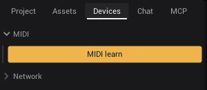

# MIDI

Play VibeVJ with a MIDI controller. Any control with a notch can follow a fader, a knob or a pad, and the controller can
follow VibeVJ back (motor faders, pad lights).

## Your devices

MIDI devices are in the sidebar, tab **Devices**, section **MIDI**.

- Every controller that VibeVJ finds gets its own section, named after the device. Plug in a controller and it shows up.
- A controller that is unplugged keeps its section. Its name then ends in "· Offline". Plug it back in and the name goes back
  to normal.
- A device with an input (it sends MIDI to VibeVJ) shows a **MIDI mapping** button and a row *In · name*. A device with an
  output (it receives MIDI) shows a row *Out · name*.

| Button | Where | What it does |
|---|---|---|
| **MIDI learn** | top of the MIDI section | Learn mode for all devices: the next MIDI message from any controller is learned. |
| **MIDI mapping** | in the section of one device | Learn mode for this device only. Messages from other controllers are ignored while learning. |

## Map a control with MIDI learn

1. Open the tab **Devices** and the section **MIDI**.
2. Click **MIDI learn** (or **MIDI mapping** of one device). Every control now gets an amber overlay.
3. Click the overlay of the control you want to play, for example the *Mix* of a layer or the power button of a generator.
4. Move a fader or a knob, or hit a pad, on the controller. The overlay now shows what was learned, for example "CC 7 ch1"
   or "N 36 ch10", and the control jumps to the value of the controller.
5. Click the overlay of the next control and move the next fader. Repeat for every control you want.
6. Click **MIDI learn** (or **MIDI mapping**) again to leave learn mode. The overlays go away and the mappings stay.

Tips:

- Moving another fader while a control is still selected replaces its mapping. Select the next control first.
- Several controls can learn the same fader. They all follow it.
- A mapping belongs to one device, found by its name. It is saved with the project and works again as soon as a device with
  the same name is connected.

## What a message does

| From the controller | The control gets |
|---|---|
| Control change (CC) | the value of the knob or fader, 0 to 127 spread over the range of the control |
| Note (pad, key) | the velocity while pressed, 0 when released |
| Pitch bend, program change, aftertouch | the value of the message |

The value always fills the whole range of the control. To scale or invert it, map a helper control and link it on with a
*normalized* or *inverted* link (see [Linking](Linking.md)).

## The MIDI tab in the options

Click a notch of a control to open its options. The tab **MIDI** shows the mapping of this control.

| Item | What it does |
|---|---|
| Mapping row, for example "nanoKONTROL2 CC 7 · ch 1" | Shows the learned device, the kind of message, its number and the channel. |
| × next to the mapping | Removes the mapping. |
| **MIDI backpropagate** | On (the default): when the value changes in VibeVJ (mouse, a link, a clip), the value is sent back to the controller, so motor faders move and pad lights follow. Turn it off if the controller should only send. |

Some controls have no options menu (for example *Target FPS* or *Cable view* in *Project › Settings*). To remove their
mapping, turn on **MIDI learn**, click the overlay of the control and press Esc.

## What can be mapped

Every control with a notch: value fields and sliders, control buttons, combo boxes and segmented controls, the power
button of a generator window, the Clipview columns, layers and transport, the timeline transport, fixture channels.
Plain buttons without a notch (for example *Save* in the Project tab) cannot be mapped.

Pure outputs (rows with only a right notch, such as *BPM* or *Low energy* of [Audio Input Analysis](Audio.md)) are written
by their generator all the time. A MIDI mapping on them is overwritten at once, so map the controls they drive instead.

## Show mode

In show mode the notches are locked, so options and links cannot be changed. Mapped controls still follow the controller.
Set up your mappings before the show. See [Timeline](Timeline.md#show-mode).

## See also

- [Linking](Linking.md): pass a mapped value on to other controls
- [Generators](Generators.md): the power button and the window header
- [Troubleshooting](Troubleshooting.md): a controller that does not react
- [Glossary](../../design/wiki/Glossary.md)
