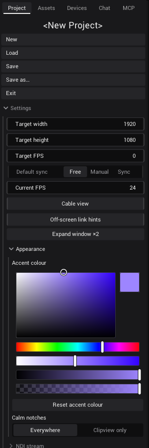

# Settings

The settings live in the sidebar, in the *Project* tab, under *Settings*. Some belong to the project, the ones in
*Appearance* are personal and valid for every project. This page also explains how to scale views with Page Up and Page
Down.

## Open the settings

1. In the sidebar, open the *Project* tab.
2. Click *Settings* to open the section.
3. Click *Appearance* inside it for the personal settings.

## Project settings

These settings are saved with the project.

| Setting | What it does |
|---|---|
| *Target width*, *Target height* | The output size, 1920 × 1080 at the start. New shader generators and the mapping tools start with this size. |
| *Target FPS* | How many frames per second VibeVJ draws. Starts at the refresh rate of your screen. The lowest value is 30; 0 means no limit. |
| *Default sync* | How the time of a new shader generator runs: *Free*, *Manual* or *Sync* (see below). |
| *Current FPS* | Shows the frames per second VibeVJ reaches right now. |
| *Cable view* | Draws every link whose two controls are on screen, and shows all notches in full: the cable view. |
| *Off-screen link hints* | Puts a small badge with a number on a control whose link partner is not on screen. |
| *Expand window ×2* | Makes the VibeVJ window twice as wide, for example to span two screens. Press it again to go back. |
| *NDI stream* | *Enable NDI* sends the whole VibeVJ window, interface included, as an NDI source named after *NDI name* (*ProgramOut* at the start). |

The NDI output of a single shader is on [Output and devices](Output-and-Devices.md).

### Default sync

Every shader generator has a *Time* section with its own *Sync* setting. *Default sync* only sets what a **new** shader
starts with; you can change each shader later.

| Choice | The shader's time |
|---|---|
| *Free* | Runs on its own, in seconds, times the shader's *Multiplier*. |
| *Manual* | Stands still. You set *Time* yourself, or link it to another control. |
| *Sync* | Follows the timeline position, in beats. It stops when the timeline stops. |

### Cable view and off-screen link hints

*Cable view* turns the whole screen into the cable view: every notch is shown in full and every link whose two ends
are visible is drawn as a cable. Turn it off to keep the screen calm while you play.

- A generator with *Always draw links* on (the link icon in its header) draws its own cables also when *Cable view* is
  off. See [Generators](Generators.md).
- *Off-screen link hints* work only while *Cable view* is on. The badge counts the links of that control whose other end
  is not visible right now: in another tab, scrolled away or covered by a window. It is not the number of all links.
- In show mode there is no cable view and no badges.

More about cables and notches: [Linking](Linking.md) and [Links and notches](../../design/wiki/Links-and-Notches.md).

## Appearance

The settings in *Appearance* are personal. They are not saved in the project but in the file `VibeVJ/engine/style.json`,
so they stay the same for every project. They take effect at once.

| Setting | What it does |
|---|---|
| *Accent colour* | The colour picker sets your highlight colour, used for links and selection. Violet at the start. |
| *Reset accent colour* | Sets the accent colour back to violet. |
| *Calm notches* | Where notches are calm: *Everywhere* (the standard) or *Clipview only*. |

### Calm notches

Calm notches are thin edges at rest. They open to full notches when you move the mouse over a row, while you drag a link,
and in the cable view.

| Choice | What you see |
|---|---|
| *Everywhere* | Calm notches in every view. |
| *Clipview only* | The Clipview stays calm, all other views show full notches. |

To change it:

1. Open *Settings* › *Appearance*.
2. Pick *Everywhere* or *Clipview only* under *Calm notches*.

The cable view always shows every notch in full, whatever you pick.

## View scaling with Page Up and Page Down

You can make the content of a view bigger or smaller, for example to fit a big Clipview on a small screen.

1. Click into the view, or into the sidebar.
2. Press Page Up to make it bigger, Page Down to make it smaller. Each press changes the size by about 10 %.

| Where | How to scale | Kept after a restart |
|---|---|---|
| The *Views* tab, a tab of a Tabview, half of a split | Page Up / Page Down | Yes, with the project |
| The sidebar | Page Up / Page Down | No |
| A Patchview and the timeline area | Mouse wheel; right mouse button drags the area | No |

Scaling does not work while a generator window is maximized.

## See also

- [Linking](Linking.md)
- [The screen](The-Screen.md)
- [Output and devices](Output-and-Devices.md)
- [Shortcuts and tips](Shortcuts-and-Tips.md)
- [Links and notches](../../design/wiki/Links-and-Notches.md) (design wiki)
