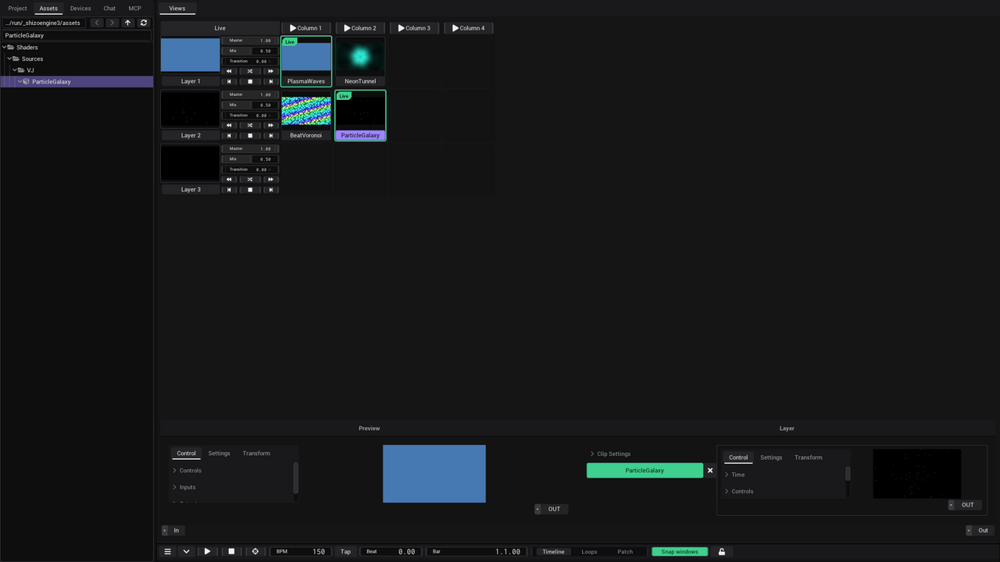

# The screen

This page shows where things are in the VibeVJ window: the sidebar, the views with their tabs, the generator windows and
the timeline area. You design most of the screen yourself, by dropping views into views.

## The four areas

| Area | Where | What it is for |
|---|---|---|
| Sidebar | Left | Your project, the assets, devices and the AI chat |
| Views | Right, top | The work area: one view or generator per tab, views can hold more views |
| Generator windows | Inside the views | One window per generator, with its controls |
| Timeline | Bottom | Tempo, play position, transport and show mode |

## Sidebar

The sidebar has five tabs.

| Tab | What you find there |
|---|---|
| *Project* | The project name, *New*, *Load*, *Save*, *Save as…*, *Exit*, the *Settings* and the *Recent* list. See [Getting started](Getting-Started.md) and [Settings](Settings.md). |
| *Assets* | All assets in the `assets` folder: generators, shaders, views, textures, fixtures. |
| *Devices* | *MIDI*, *Network* (*Artnet*, *Shizonet*) and *Fixtures*. See [MIDI](MIDI.md) and [Output and devices](Output-and-Devices.md). |
| *Chat* | An AI chat that can look at and change your generators. |
| *MCP* | A server for outside AI tools (for example Claude), next to the chat. |

- **Show or hide the sidebar:** the ☰ button at the left of the timeline bar (tooltip *Show / hide the sidebar*). The views
  and the timeline take the free space.
- **Make it wider or narrower:** drag its right edge.
- **Make its content bigger or smaller:** click into the sidebar, then press Page Up or Page Down.

### Assets tab

- Folders with a **cube icon** are assets (for example *SineGenerator* or a shader). The list shows names without their file extension. Drag them into a view.
- At the top: back, forward, up and refresh buttons, the current folder, and a *Filter* box that finds files by name.
- **Double-click a file** to open its text in a new tab next to *Views*. Close that tab with its ×.
- After you save a preset, press refresh if the new file does not show up yet.

### Chat tab

1. The first time, fill in *API*, *Token* and, if you want, *Model*, then click *Connect*.
2. Type in the box at the bottom and click *Send*. *Stop* ends an answer, *Clear* empties the chat.
3. The list under *Clear* sets how hard it thinks: *Low*, *Medium* or *High*.

Next time, one click on *Connect* is enough.

## Views and tabs

The big area on the right has a tab bar. The first tab, *Views*, is always there. It holds exactly one view or generator.

1. Open the *Assets* tab and the folder `Views`.
2. Drag a view into the *Views* tab, where it says "Drop assets or views here".
3. Drop more views or generators into the parts of that view.

| View | What it does |
|---|---|
| Clipview | A grid of clips in layers and columns, for playing live. See [Clipview](Clipview.md). |
| Patchview | A free area: generators sit in their own windows anywhere, and their links are drawn. |
| Tabview | Tabs, each holding one view or generator. |
| HorizontalSplit | Two parts side by side. Drag the divider to change the sizes. |
| VerticalSplit | Two parts on top of each other. Drag the divider to change the sizes. |
| CueList | A list of cues for a show, with *Live*, *Autoplay* and *Random*. |

Things to know:

- **Nesting:** every part of a Tabview or a split can take any view, so you can put a Clipview in one tab and a Patchview
  in the other half of a split.
- **Replacing:** a part holds one thing. Dropping onto a part that is not empty asks "Overwrite view?". *Yes* replaces it.
- **Tabview:** drop an asset on the tab bar to get a new tab named after it. Double-click a tab to rename it. Click its ×
  to delete it ("Delete tab?").
- **Size:** click into a view and press Page Up or Page Down to scale it. The scale is saved with the project.

> Screenshot to add: a Tabview with two tabs, one open tab showing a HorizontalSplit with a Clipview left and a Patchview
> right.

## Generator windows

Every generator lives in its own window. The window header and its buttons are on [Generators](Generators.md).

- **In a Patchview** (and in the timeline area) windows float: drag the header to move a window, drag an edge or corner to
  resize it. The mouse wheel zooms the area, dragging with the right mouse button moves it.
- **In a part of a view** (the *Views* tab, a tab of a Tabview, half of a split) the generator fills the part and has no
  header. Click into it and press E to show the header, press E again to hide it.
- In a Patchview, new windows have *Always draw links* on, so you see their cables at once.

## Timeline area

The timeline sits at the bottom. It starts as a single bar.

1. Drag the bar up to open the timeline.
2. Click the chevron button (tooltip *Open or collapse the timeline*) to close it to a bar, and again to open it at its last height.

With *Snap windows* on, the views above get smaller or bigger as you move the bar, so nothing is covered.

| In the bar | What it does |
|---|---|
| ☰ | Shows or hides the sidebar |
| Chevron | Closes the timeline to a bar |
| Link | *Cable view* on or off. The small violet bubble counts the local cable views; rest the mouse on it and the broken link on its right half ends them all. See [Linking](Linking.md#seeing-your-links). |
| Lock | Show mode. See [Timeline](Timeline.md). |
| Play, Stop, Follow | Transport. Stop also goes back to the start. |
| *BPM*, *Tap* | Tempo, and tap tempo |
| *Beat*, *Bar* | Where the playhead is |
| *View* | *Timeline*, or *Loops* / *Patch*: a free area for generator windows. Windows there snap to a grid. |
| *Snap windows* | Keeps the views and the timeline stacked |

Today *Loops* and *Patch* show the same area.

## See also

- [Generators](Generators.md)
- [Clipview](Clipview.md)
- [Timeline](Timeline.md)
- [Settings](Settings.md)
- [Views](../../design/wiki/Views.md) (design wiki)
