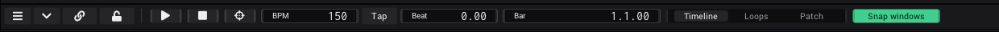
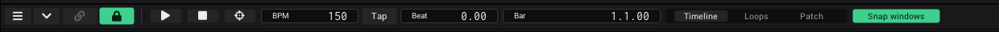

# Timeline

The timeline sits at the bottom of the window. Its transport bar holds the only global controls: tempo, position, Play and
the show mode lock. Autoplay in the [Clipview](Clipview.md) and every synced shader run on its beats.

## The transport bar

From left to right:

| Control | What it does |
|---|---|
| Sidebar icon | Shows or hides the sidebar. |
| Chevron | Collapses the timeline to its bar. Click it again (or drag the bar up) to open it at its last height. |
| Link | *Cable view* on or off: every link on screen as a cable. The same switch as in *Project* › *Settings*. Green while on, greyed out in show mode. While it is off, a small violet bubble on its top right corner counts the generators with their own link icon on (local cable views). Rest the mouse on the button for a moment and it splits: a broken link slides in on its right half, a click on it ends them all. See [Linking](Linking.md#seeing-your-links). |
| Lock | Show mode. See below. |
| *Play* | Runs the timeline. Green while playing. Click again to pause. |
| *Stop* | Stops and goes back to the start (Bar 1.1.00). |
| *Follow* | Tooltip *Follow the playhead*. It can be switched on and linked, but has no effect yet. *(Planned.)* |
| *BPM* | The tempo. Default 150. |
| *Tap* | Tap the tempo. |
| *Beat* | Where the playhead is inside the current beat, from 0 to 1. |
| *Bar* | The position as bar.beat.tick. |
| *View* | *Timeline* / *Loops* / *Patch*. |
| *Snap windows* | Keeps the view area above the timeline the right size. On by default. |

*Play*, *Stop*, *Follow*, *BPM*, *Beat*, *Bar*, *View* and *Snap windows* have notches, so you can link them or map them to
MIDI. See [Linking](Linking.md).

## Set the tempo

1. Click *BPM* and type the tempo. Press Enter.
2. Or click *Tap* on each beat, at least twice. The tempo is the average of your last taps. Wait two seconds to start over.
3. Or let the audio set it: see [Sync the timeline from audio](#sync-the-timeline-from-audio).

## Beat and Bar

- *Bar* shows the position as bar.beat.tick, with 4 beats per bar. Ticks are hundredths of a beat. The start is 1.1.00.
- To jump, click *Bar* and type the position **in beats**, then press Enter. For example 16 jumps to 5.1.00.
- *Beat* runs from 0 to 1 within every beat. Link it to anything that should pulse with the music.

## The ruler

| Gesture | Does |
|---|---|
| Scroll on the ruler | Zooms in or out around the mouse. |
| Drag on the ruler | Left or right moves the view, up or down zooms. |
| Right click on the ruler | Moves the playhead to the nearest grid line. |
| Drag the line between two lanes | Makes a lane taller or smaller. |
| Drag the top edge of the timeline | Makes the timeline taller or smaller. |

## The view switch

| View | Shows |
|---|---|
| *Timeline* | The ruler, playhead and lanes. |
| *Loops* | An area for generator windows that belong to the timeline. |
| *Patch* | Today the same area as *Loops*. |

The generators in this area are saved with the project.

## Snap windows

With *Snap windows* on, the view area above always ends where the timeline starts, so moving the timeline up or down resizes
the views. With it off, the views only get smaller when the timeline would cover them.

## Show mode

Show mode locks the app for performing, so nothing gets linked, moved or closed by accident, by mouse or by touch.

1. Click the lock at the left of the bar, next to the chevron (tooltip *Show mode: lock notches and editing*). It closes
   and turns green.
2. Play your show.
3. To leave, press the lock, hold it for at least 400 ms, then let go. A short click does nothing, so a stray touch does
   not unlock it.

| Locked | Still working |
|---|---|
| Notches: no options, no linking, no hold and drag | Values and sliders |
| Moving and resizing windows | Buttons and transport |
| Dropping assets, moving clips | Clips and columns |
| Closing generators, *Paste settings*, *Reload module* | MIDI |
| Deleting view tabs | |

While locked, free notches are hidden and linked ones stay as a coloured edge. No cables are drawn. See
[Linking](Linking.md#show-mode).

## Sync the timeline from audio

1. Add the *Audio Input Analysis* generator (see [Audio](Audio.md)).
2. Turn on its *Sync timeline* button.
3. Press *Play*.

The timeline's *BPM* now follows the detected tempo, and the playhead is nudged gently into step with the beat. Turn
*Sync timeline* off to set the tempo yourself again. The *Prolink Bridge* generator can do the same with CDJs, see
[Output and devices](Output-and-Devices.md).

## See also

- [Clipview](Clipview.md): autoplay runs on timeline beats
- [Audio](Audio.md)
- [Linking](Linking.md)
- [Shortcuts and tips](Shortcuts-and-Tips.md)
- Design: [Views](../../design/wiki/Views.md), [Glossary](../../design/wiki/Glossary.md)
