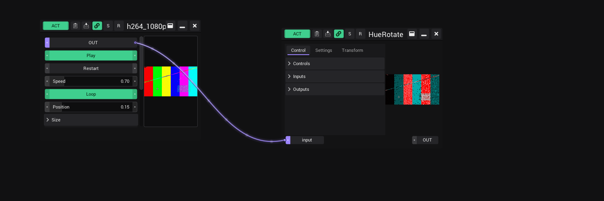
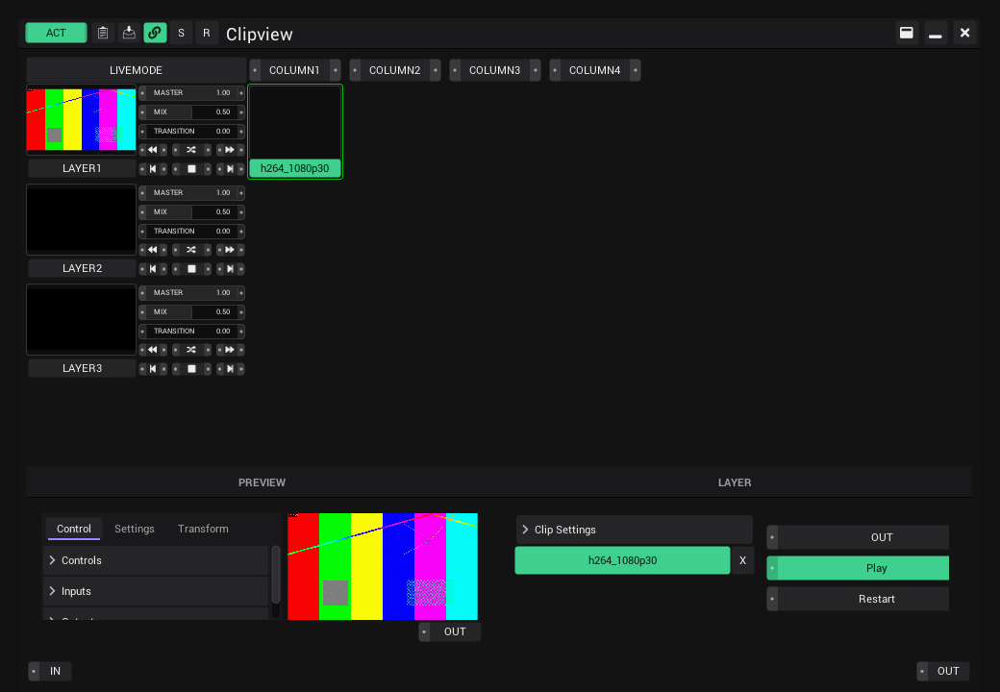

# Video clips

Play video files as generators: in the Patchview, in a Clipview cell, as input of a shader or on a mapped output.

## What you need

VibeVJ decodes video with FFmpeg. On Windows the FFmpeg libraries (`avformat-60.dll`, `avcodec-60.dll`, `avutil-58.dll`,
`swscale-7.dll`, `swresample-4.dll`) have to sit next to `shzmodule_nanogui.dll` (or in its `ffmpeg` folder). Without them a
video generator shows why it cannot play instead of a picture.

## Use a video

1. Open the **Assets** tab and find the file (`.mp4 .mov .m4v .mkv .webm .avi .mxf .mpg .mpeg .ts .wmv`).
2. Drag it into a **Patchview**, or into a cell of a **Clipview**. In a Clipview, click the cell to start the clip on its layer.
3. Link **OUT** to the input of a shader or another generator. The video is a picture source like an image or a shader.

## Controls

| Control | What it does |
|---|---|
| **OUT** | The picture. Link it to an input. |
| **Play** | Plays or holds the current frame. |
| **Restart** | Starts the clip from its first frame. |
| **Speed** | 0 to 4 times normal speed. Backwards is planned. |
| **Loop** | On: the clip starts over at its end. Off: it stops on its last frame. |
| **Position** | Shows where the clip is (0 to 1). Setting the position is planned. |
| **Size** | Width and height of the video. |
| **Options > Flip Y** | Turns the picture upside down. |
| **Options > HW Decode** | On: the graphics card decodes the video. Off: the processor does. Leave it on. |
| **VideoRouter > Enable Router** | Offers the clip under its name in the input lists of LEDMapper and MapLab. |

**ACT** off stops the clip from decoding, so clips that are not shown cost nothing. Speed, Loop and the options are saved with
the project. A clip always starts from its beginning after loading.

The line under the controls tells how the clip is decoded, for example `h264 1920x1080 60 fps, d3d11va, zero-copy`:

- `d3d11va` (or another decoder name): the graphics card decodes. `software`: the processor decodes.
- `zero-copy`: the frames stay on the graphics card all the way. This is the fastest path (Windows).

## Which files play well

- **H.264 and HEVC** (`.mp4`, `.mov`, `.mkv`), 8 or 10 bit, are decoded by the graphics card. On an RTX 4080 about 14 clips
  1080p60 H.264, 24 clips 1080p60 HEVC, 4 clips 4K60 H.264 or 8 clips 4K60 HEVC run at the same time without dropped frames.
  With more clips than the graphics card can decode, the clips slow down; the rest of VibeVJ keeps its frame rate.
- **HAP, ProRes and DNxHR** (`.mov`) are decoded by the processor. They are the formats for scrubbing and backwards
  playback, which are planned. Several 1080p clips at once are fine, 4K costs a lot of processor time.
- Videos play **without sound**.
